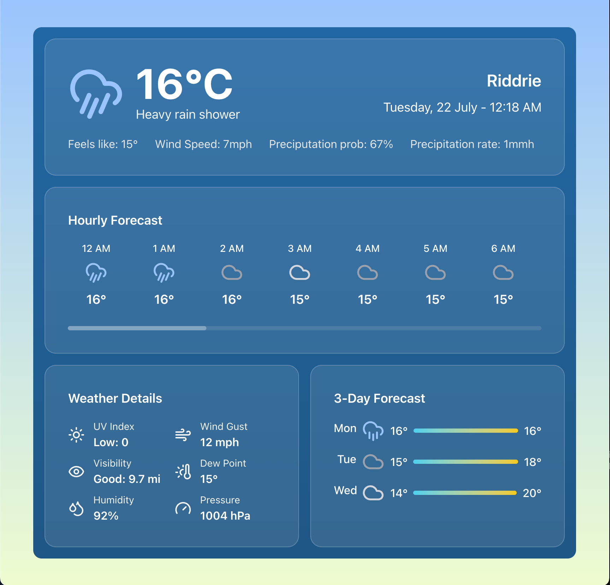

# Weather App

A modern, responsive React weather application that displays real-time weather information using the Met Office DataHub API. Built with React, Vite, and Tailwind CSS.



## Features

- 🌤️ Real-time weather data from the Met Office API
- 📍 Automatic geolocation detection
- 📱 Responsive design for all devices
- 🌙 Dynamic weather icons and conditions
- 📊 Detailed weather metrics (UV index, humidity, pressure, etc.)
- ⏰ 24-hour hourly forecast
- 📅 3-day daily forecast
- 🎨 Beautiful gradient UI with glassmorphism effects

## Table of Contents

- [Demo](#demo)
- [Prerequisites](#prerequisites)
- [Installation](#installation)
- [Configuration](#configuration)
- [Usage](#usage)
- [Project Structure](#project-structure)
- [API Documentation](#api-documentation)
- [Development](#development)
- [Deployment](#deployment)
- [Contributing](#contributing)
- [License](#license)

## Demo

Visit the live demo: [Weather App Demo](https://your-demo-url.com)

## Prerequisites

Before you begin, ensure you have the following installed:

- **Node.js** (version 18.0 or higher)
- **npm** (version 8.0 or higher)
- **Met Office DataHub API Key** (see [Configuration](#configuration))

## Installation

### Option 1: Using GitHub CLI (Recommended)

If you have the GitHub CLI installed, you can fork and clone the repository in one command:

```bash
gh repo fork https://github.com/rigsnv/weather-app.git --clone
```

GitHub CLI docs: https://cli.github.com/manual/gh_repo_fork

### Option 2: Manual Clone

You can fork the repo via GitHub's website and doenload it there to, or runnig this command.

```bash
git clone https://github.com/[your-github]/weather-app.git
```
### Install dependencies

```bash
cd weather-app
npm install
```

## Configuration

### 1. Get Met Office API Credentials

1. Visit [Met Office DataHub](https://datahub.metoffice.gov.uk)
2. Register for a free account
3. Create a new application to get your API key
4. Note your API key and base URL

### 2. Environment Setup

1. Copy the environment template:
   ```bash
   cp .env.example .env
   ```

2. Edit the `.env` file with your credentials:
   ```bash
   VITE_MET_OFFICE_API_KEY=your_api_key_here
   VITE_DEV_API_BASE_URL=https://data.hub.api.metoffice.gov.uk/sitespecific/v0/point/
   VITE_PROD_API_BASE_URL=your_production_backend_url
   ```

### 3. Environment Variables Explained

| Variable | Description | Required | Example |
|----------|-------------|----------|---------|
| `VITE_MET_OFFICE_API_KEY` | Your Met Office API key | Yes | `hjJ5GVZ...` |
| `VITE_DEV_API_BASE_URL` | Met Office API base URL for development | Yes | `https://data.hub.api.metoffice.gov.uk/sitespecific/v0/point/` |
| `VITE_PROD_API_BASE_URL` | Your backend API URL for production | No | `https://your-api.com` |

## Usage

### Development Mode

Start the development server:

```bash
npm run dev
```

The application will be available at `http://localhost:5173`

### Production Build

Build the application for production:

```bash
npm run build
```

This command will create a new folder named "dist" in the root folder of your app, bundle the app and place it in this folder.

### Preview the production build:

```bash
npm run preview
```

This command will serve from the dist folder and use your production settings, includding serving from your back end, rahter than directly calling the Met Office API and exposing your API key to the front end code as in development mode.

For more information about building for production and the different options, visit: https://vite.dev/guide/build.html

### Linting

Run ESLint to check code quality:

```bash
npm run lint
```

## Project Structure

```
weather-app/
├── public/
│   ├── cloud-sun.svg          # App favicon
│   └── vite.svg
├── src/
│   ├── components/            # React components
│   │   ├── ui/               # Reusable UI components
│   │   │   ├── WeatherCard.jsx
│   │   │   └── WeatherIcon.jsx
│   │   ├── CurrentWeather.jsx # Main weather display
│   │   ├── DailyForecast.jsx  # 3-day forecast
│   │   ├── HourlyForecast.jsx # 24-hour forecast
│   │   └── WeatherDetails.jsx # Detailed metrics
│   ├── services/             # API services
│   │   └── WeatherServicesClient.js # Met Office API client
│   ├── utilities/            # Helper functions
│   │   └── weatherCodes.js   # Weather code mappings
│   ├── WeatherApp.jsx        # Main app component
│   ├── main.jsx             # App entry point
│   └── style.css            # Global styles
├── docs/                    # Documentation
│   ├── API.md              # API documentation
│   └── DEPLOYMENT.md       # Deployment guide
├── .env.example            # Environment template
├── .gitignore
├── eslint.config.js        # ESLint configuration
├── index.html             # HTML template
├── package.json           # Dependencies and scripts
├── README.md              # This file
├── tailwind.config.js     # Tailwind CSS config
└── vite.config.js         # Vite configuration
```

## API Documentation

The app uses the Met Office DataHub API to fetch weather data. See [docs/API.md](docs/API.md) for detailed API documentation.

### Key API Endpoints

- **Site-specific forecast**: Provides hourly weather data for specific coordinates
- **Geolocation**: Browser-based location detection

### Data Flow

1. App requests user's location via geolocation API
2. Coordinates, timestep and other options are sent to Met Office API
3. Weather data is processed and displayed
4. Data refreshes automatically

## Development

### Technology Stack

- **Frontend Framework**: React 19
- **Build Tool**: Vite 7
- **Styling**: Tailwind CSS 4
- **Icons**: Lucide React
- **Date Handling**: Day.js
- **Linting**: ESLint 9

### Development Guidelines

1. **Components**: Use functional components with hooks
2. **Styling**: Use Tailwind CSS classes
3. **State Management**: React useState and useEffect
4. **Error Handling**: Implement try-catch blocks for API calls
5. **Performance**: Use React.memo for expensive components

### Adding New Features

1. Create feature branch: `git checkout -b feature/new-feature`
2. Add components in appropriate directories
3. Test thoroughly
4. Update documentation
5. Submit pull request

## Deployment

See [docs/DEPLOYMENT.md](docs/DEPLOYMENT.md) for detailed deployment instructions.

### Quick Deploy Options

- **Vercel**: Connect GitHub repository for automatic deployments
- **Netlify**: Drag and drop `dist` folder or connect repository
- **Azure Static Web Apps**: Use Azure CLI or GitHub Actions

### Environment Considerations

- **Development**: Uses Met Office API directly (not recommended for production)
- **Production**: Should use backend proxy to protect API keys

## Browser Support

- Chrome 88+
- Firefox 84+
- Safari 14+
- Edge 88+

## Contributing

1. Fork the repository
2. Create a feature branch
3. Make your changes
4. Add tests if applicable
5. Update documentation
6. Submit a pull request

### Reporting Issues

Please use the GitHub issue tracker to report bugs or request features.

## License

This project is licensed under the GNU General Public License v3.0 - see the [LICENSE](LICENSE) file for details.

## Acknowledgments

- [Met Office](https://www.metoffice.gov.uk/) for providing the weather data API
- [Lucide](https://lucide.dev/) for the beautiful weather icons
- [Tailwind CSS](https://tailwindcss.com/) for the utility-first CSS framework

## Support

If you encounter any issues:

1. Check the [troubleshooting guide](docs/TROUBLESHOOTING.md)
2. Search existing [GitHub issues](https://github.com/rigsnv/weather-app/issues)
3. Create a new issue with detailed information

---

**Author**: Ricardo Garcia  
**Version**: 1.0  
**Last Updated**: January 2025

